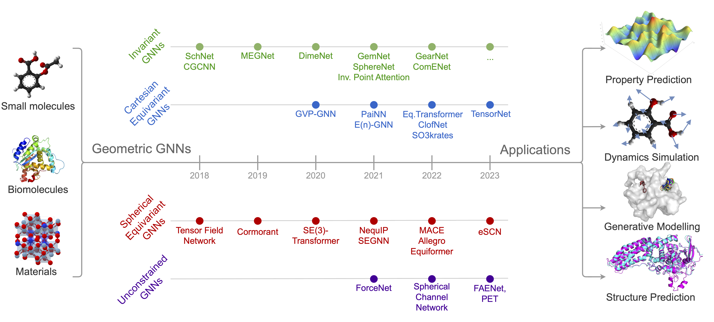

# Geometric-GNNs

In this readme, you will find the list of Geometric GNNs for 3D atomic systems, maintained up to date by the community. 
In the rest of the repository, you also have the [list of datasets for Geometric GNNs](https://github.com/AlexDuvalinho/geometric-gnns/blob/main/coding-libraries.md), as well as a [list of useful software libraries](https://github.com/AlexDuvalinho/geometric-gnns/blob/main/software.md). 

<figure>

</figure>

| Model | Year | Family | Tensor type | Body order | Source |
| :---  | ---: | ---:   | ---:         | ---: | ---: |
|SchNet| 2017| invariant	| scalar	| 2 | [link](https://arxiv.org/pdf/1706.08566.pdf) |
|CGCNN|	2017|	invariant|	scalar|	2| [link](https://arxiv.org/abs/1710.10324)|
|TFN|	2018|	equivariant|	spherical|	2|  [link](https://arxiv.org/pdf/1802.08219.pdf)|
|PhysNet|	2019|	invariant|	scalar|	2| [link](https://arxiv.org/pdf/1902.08408.pdf) |
|DimeNet|	2019|	invariant|	scalar|	3| [link](https://arxiv.org/pdf/2003.03123.pdf)|
|MEGnet|	2019|	invariant||		| [link](https://reader.elsevier.com/reader/sd/pii/S1053811921006777)|
|Cormorant|	2019|	equivariant|	spherical|	| [link](https://arxiv.org/pdf/1906.04015.pdf)|
|DimeNet++|	2020|	invariant|	scalar|	3| [link](https://arxiv.org/abs/2011.14115)|
|GVP-GNN|	2020|	equivariant|	cartesian|	3| [link](https://arxiv.org/pdf/2009.01411.pdf)|
|LieTransformer| 2020||			|| [link](https://arxiv.org/abs/2012.10885)|
|LieConv| 2020 ||				|| [link](https://arxiv.org/abs/2002.12880)|
|OrbNet| 2020||				|| [link](https://arxiv.org/abs/2007.08026)|
|SE3-Transformers|	2020|	equivariant| spherical|		| [link](https://arxiv.org/abs/2006.10503)|
|SpinConv|	2021|	invariant| spherical|| [link](https://arxiv.org/abs/2106.09575)|
|ForceNet|	2021|	unconstrained| scalar|	2| [link](https://arxiv.org/abs/2103.01436)|
|Graphormer|	2021|	invariant| |		| [link](https://arxiv.org/abs/2106.05234)|
|SphereNet|	2021|	invariant|	scalar|	4| [link](https://arxiv.org/abs/2102.05013)|
|GemNet|	2021|	invariant|	scalar|	4| [link](https://arxiv.org/abs/2106.08903)|
|ChIRo|	2021|	invariant|	scalar|	| [link](https://arxiv.org/abs/2110.04383)|
|SEGNN|	2021|	equivariant|	spherical|	2| [link](https://arxiv.org/abs/2110.02905)|
|EGNN|	2021|	equivariant|	cartesian|	2| [link](https://arxiv.org/pdf/2102.09844.pdf)|
|PaiNN|	2021|	equivariant|	cartesian|	2| [link](https://arxiv.org/abs/2102.03150)|
|NeuquIP|	2021|	equivariant|	spherical|	2| [link](https://arxiv.org/abs/2101.03164)|
|SpookyNet|	2021|	invariant||		| [link](https://arxiv.org/abs/2105.00304)|
|EQGAT|	2022|	equivariant|	cartesian|	2| [link](https://arxiv.org/pdf/2202.09891.pdf)|
|Torch-MDNet|	2022|	equivariant|	cartesian|	2| [link](https://arxiv.org/abs/2202.02541)|
|GNS|	2022|	unconstrained |	scalar|	| [link](https://arxiv.org/abs/2002.09405)|
|GNN-LF|	2022|	invariant|	scalar|| [link](https://arxiv.org/abs/2208.00716)|
|ComeNet|	2022|	invariant|	scalar|4| [link](https://arxiv.org/pdf/2206.08515.pdf)|
|So3krates|	2022|	equivariant|	cartesian|	2| [link](https://arxiv.org/abs/2205.14276)|
|Equiformer|	2022|	equivariant|	spherical|	2| [link](https://arxiv.org/abs/2206.11990)|
|MACE|	2022|	equivariant|	spherical |Many| [link](https://arxiv.org/abs/2206.07697)|
|GemNet-OC|	2022|	invariant|	scalar|	4| [link](https://arxiv.org/abs/2204.02782)|
|ClofNet|	2022|	equivariant|	cartesian|	| [link](https://proceedings.mlr.press/v162/du22e/du22e.pdf)|
|Allegro| 2022||				|| [link](https://arxiv.org/abs/2204.05249)|
|LeftNet|	2023 ||			|| [link](https://arxiv.org/abs/2304.04757)|
|ViSNet-LSRM|	2023|	equivariant |	cartesian|	| [link](https://arxiv.org/pdf/2304.13542.pdf)|
|SCN|	2023|	unconstrained|	spherical	| | [link](https://arxiv.org/abs/2206.14331)|
|TensorNet|	2023| equivariant |	cartesian || [link](https://arxiv.org/abs/2306.06482)|
|FAENet|	2023|	unconstrained | scalar |	Many|| [link](https://arxiv.org/abs/2305.05577)|
|eSCN|	2023|	equivariant|	spherical|	| [link](https://arxiv.org/abs/2302.03655)|
